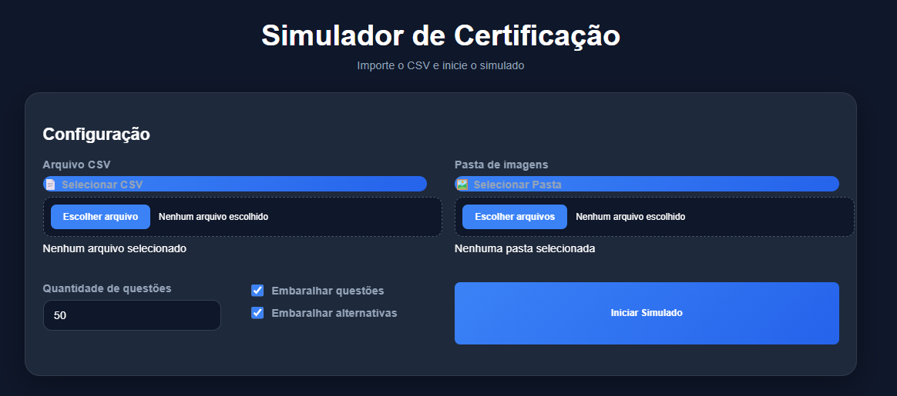
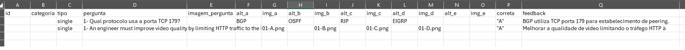

# 🎓 Simulador de Certificação

Sistema web para criação e execução de simulados a partir de arquivos CSV, com suporte a:

- ✅ Questões de alternativa única
- ✅ Questões com imagens
- ✅ Embaralhamento de perguntas
- ✅ Embaralhamento de alternativas
- ✅ Revisão completa ao final
- ✅ Feedback por questão
- ✅ Estatísticas de desempenho
- ✅ Interface moderna em modo escuro

---

## 📸 Interface



A aplicação permite carregar:

- Arquivo CSV contendo as questões
- Pasta contendo todas as imagens utilizadas no exame

Após carregar os arquivos, basta clicar em **Iniciar Simulado**.

---

# 📋 Estrutura do Arquivo CSV

O banco de questões é alimentado através de um arquivo CSV.

A estrutura deve seguir exatamente o formato abaixo:



---

## 📑 Colunas Obrigatórias

| Coluna | Descrição |
|----------|----------|
| id | Identificador da questão |
| categoria | Categoria da questão |
| tipo | Tipo da questão (`single` ou `multiple`) |
| pergunta | Texto da pergunta |
| imagem_pergunta | Nome da imagem da pergunta (opcional) |
| alt_a | Texto da alternativa A |
| img_a | Imagem da alternativa A (opcional) |
| alt_b | Texto da alternativa B |
| img_b | Imagem da alternativa B (opcional) |
| alt_c | Texto da alternativa C |
| img_c | Imagem da alternativa C (opcional) |
| alt_d | Texto da alternativa D |
| img_d | Imagem da alternativa D (opcional) |
| alt_e | Texto da alternativa E |
| img_e | Imagem da alternativa E (opcional) |
| correta | Resposta correta |
| feedback | Explicação exibida ao final |

---

## 📝 Exemplo de Questão

```csv
id,categoria,tipo,pergunta,imagem_pergunta,alt_a,img_a,alt_b,img_b,alt_c,img_c,alt_d,img_d,alt_e,img_e,correta,feedback

1,Roteamento,single,Qual protocolo usa a porta TCP 179?,,BGP,,OSPF,,RIP,,EIGRP,,,,A,BGP utiliza TCP porta 179 para estabelecer sessões de peering.
```

---

## 🖼️ Utilizando Imagens

As imagens devem estar na pasta selecionada durante o carregamento do simulado.

Exemplo:

```text
/imagens
├── 01-A.png
├── 01-B.png
├── 01-C.png
├── topologia01.png
└── bgp-lab.png
```

No CSV:

```csv
imagem_pergunta,topologia01.png
img_a,01-A.png
img_b,01-B.png
img_c,01-C.png
```

O sistema localizará automaticamente os arquivos na pasta carregada.

---

## 🎯 Questões Single Choice

Utilize:

```csv
tipo
single
```

Exemplo:

```csv
correta
A
```

---

## 🎯 Questões Multiple Choice

Utilize:

```csv
tipo
multiple
```

Exemplo:

```csv
correta
A,C,E
```

As respostas corretas devem ser separadas por vírgula.

---

## 🚀 Executando

Basta abrir:

```text
index.html
```

no navegador.

Nenhuma instalação é necessária.

---

## 📊 Resultado Final

Ao finalizar o exame o sistema apresenta:

- Total de acertos
- Total de erros
- Percentual de aproveitamento
- Revisão completa das respostas
- Feedback detalhado por questão

---

## 📄 Licença

Projeto distribuído sob licença MIT.
